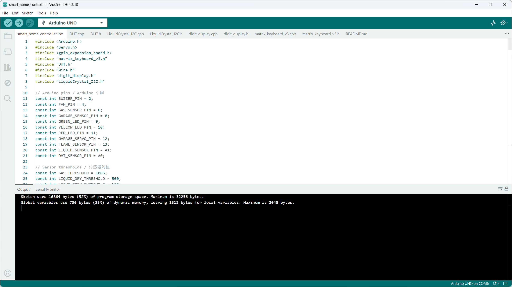
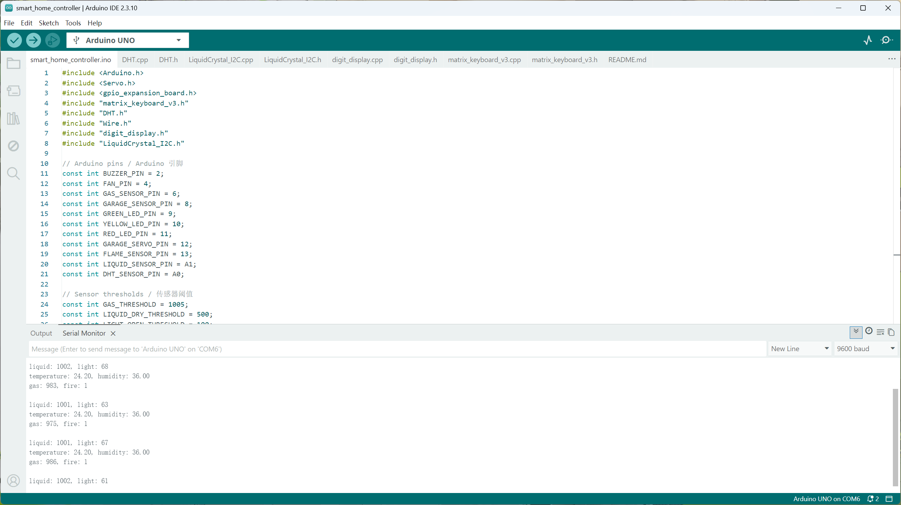

# Smart Home IoT System

An Arduino-based smart-home prototype that integrates environmental sensors, user input, display modules, LEDs, a buzzer, a DC fan, and servo-controlled doors/windows into one rule-based embedded control system.

The system was built with an Arduino UNO and a GPIO expansion board. It controls motion-responsive lighting, a touch-activated doorbell, password-based entrance access, automatic garage-door movement, rain/light-based window control, ventilation, smoke/fire alarm behavior, and real-time display output.

## Demo Video

[Watch the demo video](https://youtu.be/fw92u8Fqvqw)

The demo shows the keypad-controlled entrance door, automatic garage-door servo, motion-responsive LED, rain/light-based window control, LCD temperature and humidity display, buzzer alarm, and fan-control behavior.

## Project Images

### Hardware Overview


### Arduino IDE Compile Success



### Serial Monitor Output



## Project Status

This is the stable delay-based version of the project.

The current implementation intentionally uses `delay()` for several physical actions, including the doorbell melody, garage-door timing, entrance-door timing, window update timing, keypad LED feedback, and buzzer alarm sounds. This version prioritizes stable hardware behavior for demonstration.

A future version could replace blocking `delay()` calls with `millis()`-based non-blocking state machines.

## Development Environment

| Item | Details |
|---|---|
| Microcontroller | Arduino UNO |
| IDE | Arduino IDE 2.3.10 |
| Language | Arduino C/C++ |
| Serial Baud Rate | 9600 |
| Main Firmware File | `smart_home_controller.ino` |
| Hardware Interface | Arduino UNO with GPIO expansion board |

## Repository Structure

The recommended repository structure is:

```text
smart_home_controller/
├── smart_home_controller.ino
├── README.md
├── DHT.h
├── DHT.cpp
├── LiquidCrystal_I2C.h
├── LiquidCrystal_I2C.cpp
├── digit_display.h
├── digit_display.cpp
├── matrix_keyboard_v3.h
├── matrix_keyboard_v3.cpp
└── images/
    ├── hardware-overview.jpg
    ├── arduino-ide-compile-success.png
    └── serial-monitor-output.png
```

The project also depends on Arduino or hardware-kit libraries included through headers such as:

```cpp
#include <Arduino.h>
#include <Servo.h>
#include <gpio_expansion_board.h>
#include "Wire.h"
```

These dependencies are required for compilation but are not all included as standalone files in this repository.

## Hardware Components

### Input Modules

| Component | Purpose |
|---|---|
| Gas sensor | Detects smoke or poor air-quality conditions |
| Flame sensor | Detects fire-related conditions |
| DHT temperature and humidity sensor | Measures temperature and humidity |
| Infrared obstacle sensor | Controls garage-door behavior |
| Liquid sensor | Detects rain or water for window control |
| Photoresistor | Measures ambient light level |
| Touch sensor | Triggers the doorbell |
| PIR motion sensor | Controls motion-responsive lighting |
| Matrix keypad | Accepts password input for entrance-door control |

### Output Modules

| Component | Purpose |
|---|---|
| Garage-door servo motor | Opens and closes the garage door |
| Entrance-door servo motor | Opens and closes the main entrance door |
| Window servo motor | Opens and closes the window |
| DC fan module | Provides ventilation under smoke, high-temperature, or high-humidity conditions |
| Passive buzzer | Plays doorbell melody and smoke/fire alarm tones |
| Green LED | Indicates motion detection |
| Yellow LED | Provides keypad-input feedback |
| Red LED | Provides garage-door action feedback |
| Four-digit display | Displays ambient-light reading |
| 16x2 I2C LCD screen | Displays temperature and humidity readings |

## Pin and Module Mapping

| Pin / Interface | Constant / Address | Component | Function |
|---|---|---|---|
| D2 | `BUZZER_PIN` | Passive buzzer | Doorbell and safety alarm |
| D4 | `FAN_PIN` | DC fan module | Ventilation control |
| D6 | `GAS_SENSOR_PIN` | Gas sensor interface | Smoke/gas reading |
| D8 | `GARAGE_SENSOR_PIN` | Infrared obstacle sensor | Garage-door trigger |
| D9 | `GREEN_LED_PIN` | Green LED | Motion indicator |
| D10 | `YELLOW_LED_PIN` | Yellow LED | Keypad feedback |
| D11 | `RED_LED_PIN` | Red LED | Garage-door feedback |
| D12 | `GARAGE_SERVO_PIN` | Garage-door servo | Garage-door control |
| D13 | `FLAME_SENSOR_PIN` | Flame sensor | Fire detection |
| A0 | `DHT_SENSOR_PIN` | DHT sensor data line | Temperature and humidity |
| A1 | `LIQUID_SENSOR_PIN` | Liquid sensor | Rain/water detection |
| GPIO expansion E1 | — | Entrance-door servo | Password-controlled entrance door |
| GPIO expansion E2 | — | Window servo | Automatic window control |
| GPIO expansion E3 | — | Touch sensor | Doorbell trigger |
| GPIO expansion E4 | — | PIR motion sensor | Motion-responsive lighting |
| GPIO expansion E5 | — | Photoresistor | Ambient-light reading |
| I2C `0x65` | — | Matrix keypad | Password input |
| I2C `0x70` | — | Four-digit display | Light-value display |
| I2C `0x27` | — | 16x2 LCD | Temperature and humidity display |

## Main Features

### Motion-Responsive Lighting

The PIR motion sensor is connected through GPIO expansion pin E4. When motion is detected, the green LED turns on. When no motion is detected, the green LED turns off.

### Touch-Activated Doorbell

The touch sensor is connected through GPIO expansion pin E3. When the touch sensor is triggered, the passive buzzer plays a programmed melody using `tone()` and `delay()`.

### Automatic Garage Door

The infrared obstacle sensor controls the garage-door servo.

Servo mapping:

| Garage Door State | Servo Angle |
|---|---:|
| Open | 90 degrees |
| Closed | 5 degrees |

When the garage door opens, the red LED turns on briefly and then turns off as visual feedback.

### Password-Controlled Entrance Door

The matrix keypad is used for password input.

Current password:

```text
5879
```

Each keypad press briefly turns on the yellow LED. Pressing `#` clears the current input.

When the correct password is entered, the entrance door opens to 20 degrees, remains open briefly, and then closes to 80 degrees.

Servo mapping:

| Entrance Door State | Servo Angle |
|---|---:|
| Open | 20 degrees |
| Closed | 80 degrees |

### Automatic Window Control

The window-control subsystem uses both the liquid sensor and the photoresistor.

Liquid sensor calibration:

| Liquid Sensor Reading | Interpretation |
|---|---|
| `liquid > 500` | No rain or water detected |
| `liquid <= 500` | Rain or water detected |

The window opens only when no rain is detected and the ambient-light value is greater than 100. Otherwise, the window closes.

Servo mapping:

| Window State | Servo Angle |
|---|---:|
| Open | 0 degrees |
| Closed | 90 degrees |

### Ventilation Control

The fan is controlled through centralized rule-based logic.

The fan turns on when at least one of the following conditions is met:

| Condition | Threshold |
|---|---|
| Gas/smoke value exceeds threshold | `gas > 1005` |
| Temperature is above threshold | `temperature > 30.0` |
| Humidity is above threshold | `humidity > 45.0` |

The fan turns off when none of these conditions is met.

### Smoke and Fire Alarm

The gas sensor and flame sensor are used for safety monitoring.

When the gas value exceeds the configured threshold, the buzzer alarm activates and the fan turns on.

When the flame sensor detects fire, the buzzer alarm activates. In the current implementation, flame detection does not independently turn on the fan.

### Display Output

The four-digit display shows the current ambient-light reading.

The 16x2 LCD displays the current temperature and humidity readings from the DHT sensor.

## Software Design

The program uses a rule-based embedded control structure.

Each loop cycle checks sensor inputs, updates state variables, and controls the relevant output modules. The main logic includes:

- PIR-based motion lighting
- Touch-based doorbell melody
- Infrared-triggered garage-door control
- Matrix-keypad password access control
- Rain and light-based window control
- Gas/flame alarm behavior
- Centralized fan control
- Four-digit display output
- LCD temperature and humidity output

## Key Code Logic

### Centralized Fan Control

```cpp
bool smokeDetected = gas > GAS_THRESHOLD;
bool fireDetected = fire == 0;
bool highTemperature = temperature > TEMP_FAN_THRESHOLD;
bool highHumidity = humidity > HUMIDITY_FAN_THRESHOLD;

bool shouldRunFan = smokeDetected || highTemperature || highHumidity;
digitalWrite(FAN_PIN, shouldRunFan ? HIGH : LOW);
```

### Password Verification

```cpp
if (index == PASSWORD.length())
{
  if (keyStr == PASSWORD)
  {
    Serial.println("hello");
    keyStr = "";

    GEB.SetServoAngle(GpioExpansionBoard::kGpioPinE1, DOOR_OPEN_ANGLE);
    delay(5000);

    GEB.SetServoAngle(GpioExpansionBoard::kGpioPinE1, DOOR_CLOSED_ANGLE);
    delay(1000);
  }

  index = 0;
  keyStr = "";
}
```

## Current Implementation Notes

This version uses blocking `delay()` calls. This is intentional for the current stable hardware demonstration.

Known limitations:

- Long `delay()` calls temporarily pause other sensor checks.
- Doorbell and alarm tones share the same passive buzzer.
- Sensor thresholds may need calibration depending on the physical environment.
- The DHT reading is used directly without failed-read handling.
- LCD rows are not cleared before every update, so shorter values may leave old characters on screen.

## Debugging Method

The project was debugged through incremental module testing and Serial Monitor output.

During development, sensor values such as gas and flame readings were printed through serial communication to check whether the hardware modules were sending expected values. This helped isolate wiring problems, threshold issues, and integration errors.

## Third-Party and Hardware-Kit Code

The main application logic is in:

```text
smart_home_controller.ino
```

The following support files are included in this repository:

| File | Purpose |
|---|---|
| `DHT.h` / `DHT.cpp` | DHT temperature and humidity sensor support |
| `LiquidCrystal_I2C.h` / `LiquidCrystal_I2C.cpp` | 16x2 I2C LCD display support |
| `matrix_keyboard_v3.h` / `matrix_keyboard_v3.cpp` | Matrix keypad support |
| `digit_display.h` / `digit_display.cpp` | Four-digit display support |

The project also uses Arduino or hardware-kit dependencies such as `Servo.h`, `Wire.h`, `Arduino.h`, and `gpio_expansion_board.h`.

## Possible Future Improvements

Possible future improvements include:

- Replacing blocking `delay()` calls with `millis()`-based non-blocking state machines.
- Adding debounce logic for the touch sensor, keypad, and infrared sensor.
- Adding failed-read handling for the DHT sensor.
- Improving LCD row clearing.
- Adding structured serial logging for all sensor values.
- Adding more detailed wiring diagrams.
- Connecting the Arduino system to a Python-based monitoring dashboard.

## Author

Haotao Wang
